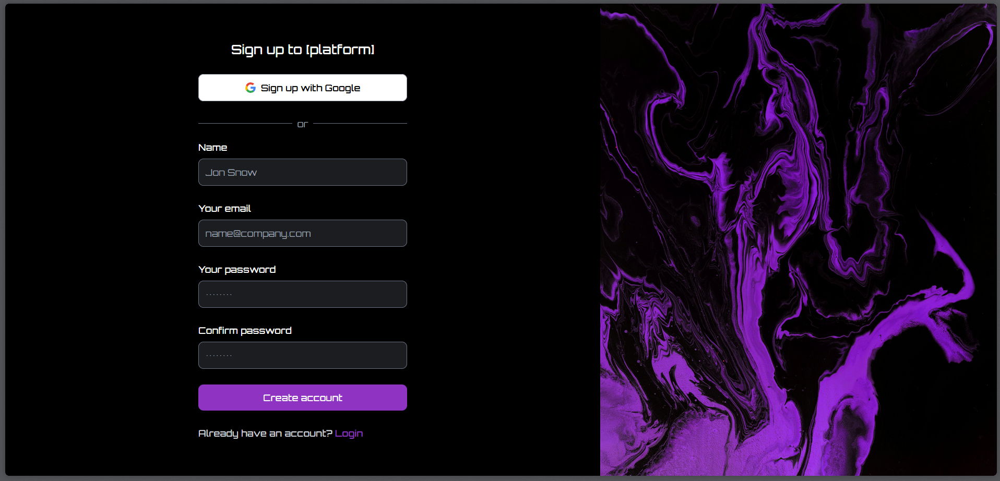
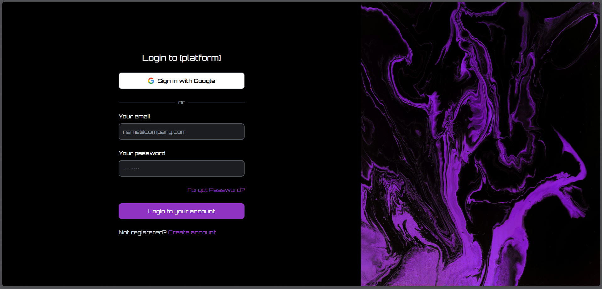
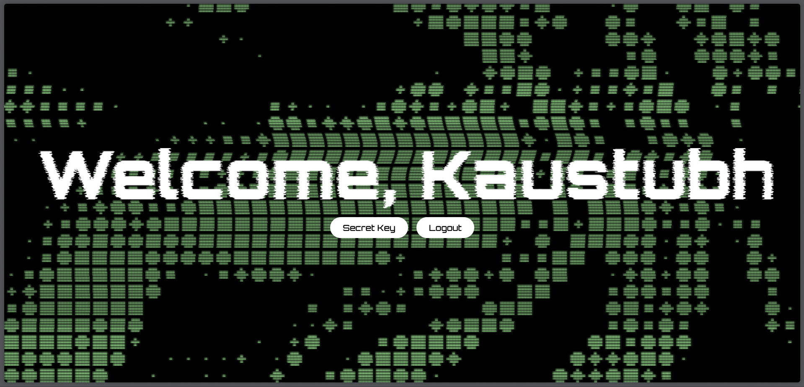
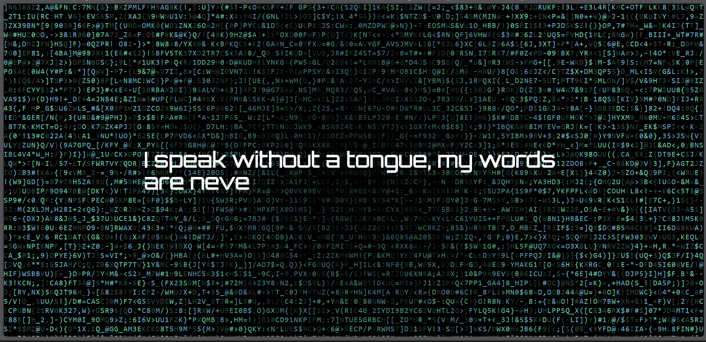
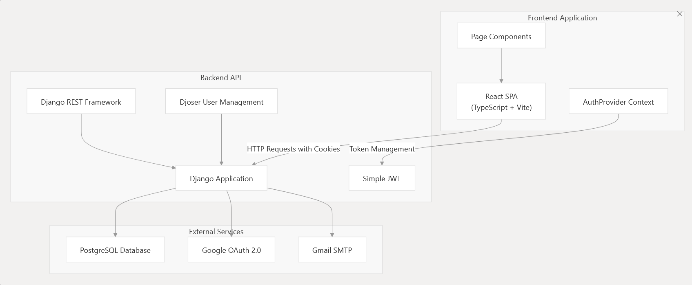

# 🔐 Retro Cyber Auth — GDG UG2 Task

**Mission Overview**  
Welcome to the **Retro Cyber World**.  
This project is built as part of the **Google Developer Group UG2 Technical Assessment**.  
It implements a secure **authentication system** with **JWT**, a **secret key discovery mechanism**, and a **retro cyberpunk UI**.  

---

## 🚀 Project Overview
This project demonstrates the development of a **secure authentication system** using **Django (REST API)** for the backend and **React** for the frontend.  
Users can **register, log in, and access protected routes**. Once authenticated, they can unlock a **hidden secret key** through a **2-step discovery process**.

The project is styled with a **retro cyberpunk theme** — glitch text, neon colors, and hacker-culture aesthetics inspired by the 1980s–1990s cyber world.

---

## 🛠️ Tech Stack
**Backend (API)**  
- Django + Django REST Framework  
- JWT Authentication (SimpleJWT)
- djoser
- HTTP only Cookies (Bonus Implementation)  

**Frontend (UI)**  
- React + Vite  
- Tailwind CSS 
- React Router for navigation  

**Deployment**  

Due to free plan limitations you may observe that the server has slept leading to non working of the auth--> just put a GET request to the backend url it will wake up the server.

- Backend: Render (https://gdg-jwt.onrender.com)
- Frontend: Render (https://gdg-jwt-frontend.onrender.com)

---

## ⚙️ Features
- 🔑 **User Registration & Login**  
- 🛡 **JWT Token Authentication** (with refresh & access tokens)  
- Email based verification of user
- 🚪 **Protected Routes** (restricted without valid JWT)  
- 🕵️ **Secret Key Discovery** (multi-step process hidden in the system)  
- Forgot password and verify email routes
- 🍪 **Secure Cookie Management** (bonus challenge)  
- 🎨 **Retro Cyber UI**:  
  - Neon Green, Electric Blue, Magenta, Cyber Purple  
  - Glitch + scanline + pixelated effects  
  - Monospace hacker-style font 

---

## 🔐 Secret Key Discovery (Spoiler)

Click to Reveal Secret Key Process

The secret key is not directly exposed. It requires logical investigation through a 3-step process:

1.  User must authenticate successfully and access the protected the **index** or /app endpoint.
2. Click the access secret key button, then solve the riddle which will lead to console.log 
3. From console.log go to inspect there see the styles of the body tag, there is key in body::after content: SriCity

---

## 📸 Screenshots

- 🔐 Registration Screen  

- 🔑 Login Screen 

- 🛡 /app or index

- /secret

---

## 🎥 Demonstration Video

https://youtu.be/R-uryQopnYc

---

## 🧩 Technical Architecture
**High-Level Flow:**  

## Key Features

### Authentication Methods

- Password  Authentication**: Traditional login with secure password handling with email verfication.
- **Google OAuth 2.0**: Single sign-on integration with Google accounts
- **JWT Token Management**: Secure token-based authentication with refresh capabilities

### Security Features

- **HTTP-Only Cookies**: Secure token storage preventing XSS attacks
- **Token Rotation**: Automatic refresh token rotation for enhanced security
- **CORS Protection**: Cross-Origin Resource Sharing configuration
- **Custom Authentication Backend**: Tailored authentication logic for specific requirements

### User Experience

- **Protected Routes**: Client-side route protection based on authentication state
- **Interactive Components**: 3D graphics and animations using Three.js (react bits components)
- **Form Validation**: Client-side validation using React Hook Form and Zod

